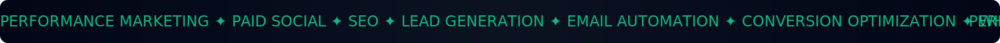

  

  

  
  
  
  
  

 

  

 

<table align="center" border="0" cellpadding="0" cellspacing="0">
  <tr>
    <td width="60%" valign="center">
      <h3>
        📈 About Me
        
      </h3>
      

        Hi, I'm <b>Ihsana Zainab</b>. I'm a results-driven digital marketer and <b>BCA graduate</b> from Calicut University, based in <b>Kozhikode, Kerala</b>.
      

      

        I help brands turn attention into measurable business outcomes — planning full-funnel campaigns across <b>Meta Ads, Google Ads, SEO, Email & WhatsApp Marketing</b>, and optimizing every step from first click to conversion.
      

      

        🔭 Working on: <b>Freelance Growth Strategy Projects</b> 
        🌱 Learning: <b>Advanced Analytics & Marketing Automation</b> 
        📍 Location: <b>Kozhikode, Kerala, India</b> 
        💼 Status: <b>Available for New Projects</b>
      

    </td>
    <td width="40%" valign="center" align="center">
      
    </td>
  </tr>
</table>

  

 

  

 

<h3 align="center">🛠️ Marketing Toolkit</h3>

  
  
  
  
    
  
  
  
  
    
  
  
  

 

<h3 align="center">📊 Skill Proficiency</h3>

  

 

<h3 align="center">🚀 Featured Services</h3>
<table border="0" width="100%">
  <tr>
    <td width="33%" align="center" valign="top">
      
        
      <b>Performance & Paid Ads</b>
       
      High-ROI Meta & Google Ads campaigns with continuous A/B testing and budget optimization.
       
      
      
    </td>
    <td width="33%" align="center" valign="top">
      
        
      <b>Social Media Marketing</b>
       
      End-to-end management of Instagram & Facebook — content calendars and growth strategies.
       
      
      
    </td>
    <td width="33%" align="center" valign="top">
      
        
      <b>SEO & Shopify Websites</b>
       
      Data-backed keyword strategy and conversion-optimized online stores.
       
      
      
    </td>
  </tr>
</table>
 

<h3 align="center">📅 Activity</h3>

  

 

  

 

  

